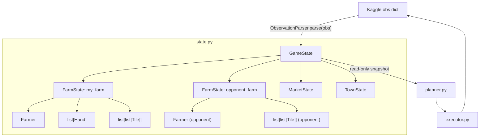

# State Layer Architecture Specification

This document details the **minimal viable design** for the typed state representation in FieldOps.

Every future module in the FieldOps pipeline (`planner`, `executor`, strategy evaluation)
will consume `GameState` instead of the raw Kaggle observation dictionary.

> **Status**: Approved for implementation (Revision 2). This is the implementation-authoritative document.

---

## Architectural Decisions (Revision 2)

The following decisions were made explicitly to prefer simplicity over completeness.
Polymorphism and richer abstractions are deferred until there is a concrete need.

| Decision | Choice | Rationale |
|---|---|---|
| Crop / Animal objects | Static `CROP_DATA` / `ANIMAL_DATA` dicts in `constants.py` | No runtime class hierarchy needed. Tables are sufficient for strategy lookup. |
| Tile representation | **Single `Tile` dataclass** with optional fields | Avoids a 5-class polymorphic hierarchy that is not yet needed. Refactor if it becomes a maintenance burden. |
| Parser entry point | `ObservationParser.parse(obs)` | Isolates raw dict access from the domain model (SRP). |
| Snapshot mutability | Immutable (`frozen=True`) | Prevents accidental state corruption between turns. |
| Validation location | Parser boundary | Errors are caught immediately on input; downstream code trusts its inputs. |
| `Crop` / `Animal` runtime objects | **Not implemented** | Defer until there is a concrete use case. |
| Builder / factory classes | **Not implemented** | Premature abstraction. |
| Polymorphic tile hierarchy | **Not implemented** | Single `Tile` dataclass is sufficient for Phase 1. |

---

## Enumerations

Plain `str` constants in `constants.py` are used throughout — not Python `Enum` — to avoid
enum serialization noise during debugging and to match the raw observation strings directly.

### Tile kinds (raw strings from the observation)
- `"PLANT"`, `"WEED"`, `"COOP"`, `"PASTURE"` — dict tiles with a `"kind"` key
- `"LOCKED"` — the string sentinel for a locked tile
- `None` — empty unlocked tile

### Other key string sets
- Crop names: `"WHEAT"`, `"CARROT"`, `"TOMATO"`, `"STRAWBERRY"`, `"MELON"`
- Animal names: `"GOOSE"`, `"COW"`, `"SHEEP"`
- Products: `"WHEAT"`, `"CARROT"`, `"TOMATO"`, `"STRAWBERRY"`, `"MELON"`, `"EGG"`, `"MILK"`, `"WOOL"`, `"FERTILIZER"`
- Quadrants: `"NW"`, `"NE"`, `"SW"`, `"SE"`
- Shops: `"BAKERY"`, `"PIZZA_SHOP"`, `"BRUNCH_SPOT"`, `"YARN_STORE"`, `"ICE_CREAM_SHOP"`, `"PET_CAFE"`, `"SMOOTHIE_SHOP"`, `"FARMERS_MARKET"`

---

## Static Metadata Tables

`CROP_DATA` and `ANIMAL_DATA` are **module-level constants** in `constants.py`.
They are plain `dict[str, dict]` — no runtime objects, no class hierarchy.

The planner looks up crop economics via `CROP_DATA["WHEAT"]["base_price"]`.
This is intentionally simple and entirely sufficient for Phase 1.

---

## Class Specifications

### `Position`

| Property | Value |
|---|---|
| Fields | `x: int`, `y: int` |
| Mutable | No (`frozen=True`) |
| Purpose | Immutable 2D board coordinate |
| Lifetime | Turn-scoped value object |

---

### `Inventory`

| Property | Value |
|---|---|
| Fields | `items: dict[str, int]` |
| Mutable | No (`frozen=True`) |
| Purpose | Typed item count collection (shed, carried items, market stock) |
| Lifetime | Turn-scoped |

`Inventory` wraps a plain `dict[str, int]`. Provides convenience accessors:
- `get(item) -> int` — count for an item (0 if absent)
- `total() -> int` — sum of all counts
- `has(item, n) -> bool` — True if count >= n

> **Deferred**: Rich `Mapping` protocol, `MappingProxyType`, or frozenset internals.
> A plain dict inside a frozen dataclass is sufficient — the dataclass field itself
> cannot be reassigned, which is the meaningful guarantee.

---

### `Farmer`

| Property | Value |
|---|---|
| Fields | `position: Position`, `inventory: Inventory` |
| Mutable | No (`frozen=True`) |
| Purpose | Main farmer unit on the field |
| Lifetime | Turn-scoped |
| Relationships | Belongs to `FarmState` |

---

### `Hand`

| Property | Value |
|---|---|
| Fields | `index: int`, `position: Position`, `inventory: Inventory` |
| Mutable | No (`frozen=True`) |
| Purpose | One hired farm hand for the day |
| Lifetime | Day-scoped (cleared at end-of-day) |
| Relationships | Part of `FarmState.hands` |

`index` is 0-based, matching the offset into `private["inventories"][1 + index]`.

---

### `Tile`

**Single dataclass. Optional fields are `None` when the tile kind does not use them.**

| Field | Type | Present when |
|---|---|---|
| `x` | `int` | Always |
| `y` | `int` | Always |
| `kind` | `str \| None` | `None` = empty; `"LOCKED"`, `"PLANT"`, `"WEED"`, `"COOP"`, `"PASTURE"` |
| `crop` | `str \| None` | `kind == "PLANT"` |
| `planted_day` | `int \| None` | `kind == "PLANT"` |
| `watered_today` | `bool \| None` | `kind == "PLANT"` |
| `consecutive_unwatered` | `int \| None` | `kind == "PLANT"` |
| `yield_units` | `int \| None` | `kind == "PLANT"` or animal tile |
| `max_lifespan_step` | `int \| None` | `kind == "PLANT"` |
| `fertilized_until_day` | `int \| None` | `kind == "PLANT"` |
| `animal` | `str \| None` | `kind in ("COOP", "PASTURE")` |
| `placed_day` | `int \| None` | `kind in ("COOP", "PASTURE")` and animal present |
| `fed_today` | `bool \| None` | `kind in ("COOP", "PASTURE")` |
| `consecutive_unfed` | `int \| None` | `kind in ("COOP", "PASTURE")` |
| `cared_today` | `bool \| None` | `kind in ("COOP", "PASTURE")` |
| `fertilizer_available` | `bool \| None` | `kind in ("COOP", "PASTURE")` |
| `pending_care_bonus` | `int \| None` | `kind in ("COOP", "PASTURE")` |

**Convenience predicates** (methods on the class):

- `is_empty() -> bool` — kind is `None`
- `is_locked() -> bool` — kind is `"LOCKED"`
- `is_plant() -> bool` — kind is `"PLANT"`
- `is_weed() -> bool` — kind is `"WEED"`
- `is_animal() -> bool` — kind in `("COOP", "PASTURE")`
- `has_animal() -> bool` — is_animal() and `self.animal is not None`
- `is_harvestable() -> bool` — `yield_units is not None and yield_units > 0`

> **Future refactor trigger**: If predicate checks appear frequently in downstream modules,
> or if type checkers struggle with the optional field pattern, introduce the polymorphic
> tile hierarchy from the original design.

---

### `FarmState`

| Field | Type | Public / Private |
|---|---|---|
| `player_index` | `int` | — |
| `money` | `float` | Public |
| `tiles` | `list[list[Tile]]` | Public |
| `farmer` | `Farmer` | Public |
| `hands` | `list[Hand]` | Public |
| `unlocked_quadrants` | `list[str]` | Public |
| `hires_today` | `int` | Public |
| `shed` | `Inventory \| None` | Private (own farm only) |
| `seeds` | `dict[str, int] \| None` | Private (own farm only) |

- `tiles[y][x]` — row-major indexing, matching the raw observation.
- `shed` and `seeds` are `None` for the opponent's farm (private fields not visible).
- `is_own_farm` is not stored as a field; callers test `shed is not None`.

---

### `MarketState`

| Field | Type | Notes |
|---|---|---|
| `inventory` | `dict[str, int]` | Current stock for all 9 tradeable products |
| `prices` | `dict[str, int]` | Current dynamic price per product (floored at $1) |

---

### `TownState`

| Field | Type | Notes |
|---|---|---|
| `unlocked_shops` | `list[str]` | Shops that are currently active |

---

### `GameState`

Root snapshot. All other modules receive this object.

| Field | Type | Notes |
|---|---|---|
| `step` | `int` | Absolute turn (0–718) |
| `day` | `int` | `step // 24` |
| `hour` | `int` | `step % 24` |
| `player_index` | `int` | Agent's own player ID |
| `my_farm` | `FarmState` | Own farm (shed and seeds populated) |
| `opponent_farm` | `FarmState` | Opponent farm (shed and seeds are `None`) |
| `market` | `MarketState` | Global market |
| `town` | `TownState` | Town shop status |

- `remaining_overage_time` is **not stored** — it is a framework bookkeeping field
  with no strategic value.

---

## Parser API

```python
class ObservationParser:
    @staticmethod
    def parse(obs: dict[str, Any]) -> GameState:
        ...
```

**Why a static class method and not a module-level `parse(obs)` function?**

The stub in the existing `state.py` uses a module-level function `parse()`.
We migrate to `ObservationParser.parse()` for two reasons:

1. **Namespace clarity**: `ObservationParser.parse(obs)` is unambiguous about what is
   being done and where the logic lives, even when imported from another module.
2. **Future extensibility**: If we ever need a stateful parser (e.g. one that caches
   tile-kind lookup tables or validates against a schema version), the class boundary
   is already there.

`ObservationParser` has no `__init__`; it is a stateless namespace for the parse logic.

---

## Validation Invariants

The parser raises `ValueError` with a descriptive message when any of the following are violated:

| Invariant | Check |
|---|---|
| Step range | `0 <= step <= TOTAL_TURNS - 2` |
| Day/hour consistency | `day == step // TURNS_PER_DAY` and `hour == step % TURNS_PER_DAY` |
| Board dimensions | Each farm tiles array is `BOARD_SIZE x BOARD_SIZE` |
| Coordinate bounds | All unit positions `0 <= x,y <= BOARD_SIZE - 1` |
| Money non-negative | `my_farm.money >= 0` |
| Inventory non-negative | All item counts `>= 0` (shed, seeds, carried inventories) |
| NW always unlocked | `"NW" in unlocked_quadrants` |
| Hand/inventory count | `len(hands) == len(private["inventories"]) - 1` |

---

## Performance

- **Objects per turn**: ~220–240 (1 GameState, 2 FarmState, 200 Tile, 2 Farmer, 0–N Hand, 2–5 Inventory, 1 MarketState, 1 TownState).
- **Estimated parse time**: < 1 ms on CPython 3.11.
- **Memory per snapshot**: ~10–15 KB. Turn-scoped; collected by Gen-0 GC after `agent()` returns.

---

## Testing Strategy

`GameState` is constructed from plain Python constructors in tests — no Kaggle environment needed.

```python
# Example: build a minimal valid GameState for a planner unit test
farm = FarmState(
    player_index=0, money=3000.0,
    tiles=[[Tile(x=x, y=y) for x in range(10)] for y in range(10)],
    farmer=Farmer(position=Position(4, 4), inventory=Inventory({})),
    hands=[], unlocked_quadrants=["NW"], hires_today=0,
    shed=Inventory({}), seeds={},
)
```

Parser tests work against hand-crafted observation dicts, not against a running
`kaggle_environments` instance.

---

## Architecture Diagram



---

## Tradeoffs

| Tradeoff | Chosen | Deferred |
|---|---|---|
| Tile representation | Single `Tile` dataclass with optional fields | Polymorphic 5-class hierarchy |
| Crop / Animal metadata | Static dict tables (`CROP_DATA`, `ANIMAL_DATA`) | Runtime domain objects with methods |
| Inventory internals | `dict[str, int]` inside frozen dataclass | `MappingProxyType` or typed inventory class |
| Parser design | `ObservationParser.parse()` static method | — (already the right choice) |

---

## Risks

1. **Optional field discipline**: With all tile variants in one dataclass, callers can
   accidentally access `tile.crop` on a `WEED` tile and get `None` silently.
   Mitigation: the predicate methods (`is_plant()`, `is_animal()`, etc.) make intent explicit.
   Document the access contract clearly in docstrings.

2. **Schema drift**: If Kaggle changes observation keys, `ObservationParser` is the only
   file that needs updating — isolation is working as intended.

---

## Deferred to Future Milestones

The following are intentionally **not** in this milestone:

- Polymorphic tile hierarchy (`PlantTile`, `LockedTile`, `WeedTile`, `AnimalStructureTile`, `EmptyTile`)
- Runtime `Crop` and `Animal` domain objects with methods
- `GameStateBuilder` / test factory helpers
- Simulation / forward-modelling of state transitions
- Pattern-matching abstractions
- Planner and executor modules (separate tasks)
